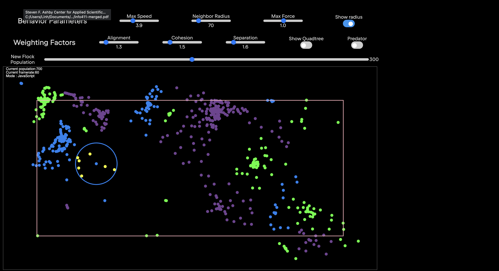

# Boids Simulation

A real-time flocking simulation implemented in both JavaScript and WebAssembly, demonstrating emergent behavior through simple rules.

## Features

- Dual implementation: JavaScript and WebAssembly (C++)
- Interactive controls for flocking parameters
- Quadtree optimization for neighbor detection
- Multiple flocks with different colors
- Predator-prey behavior
- Visual debugging tools (quadtree visualization, perception radius)



## Getting Started

### Prerequisites

- Node.js (v14 or higher)
- Emscripten (for WebAssembly compilation)
- A modern web browser

### Installation

1. Install dependencies:
```bash
npm install
```

2. Compile the WebAssembly module:
```bash
cd wasm
emcc src/main.cpp src/boid.cpp  -o ../public/wasm.js \
    -s WASM=1 \
    -s EXPORTED_FUNCTIONS='["_calculate_acceleration","_init_boids", "_simulate","_main", "_malloc", "_free"]' \
    -s EXPORTED_RUNTIME_METHODS='["ccall", "cwrap"]' -s NO_EXIT_RUNTIME=1 -s MODULARIZE=1 -s EXPORT_ES6=1 -s NO_DISABLE_EXCEPTION_CATCHING
```
```

3. Start the development server:
```bash
npm run dev
```

## Controls

### Behavior Parameters
- **Max Speed**: Controls maximum boid velocity (1.0-10.0)
- **Neighbor Radius**: Sets the range for neighbor detection (0-500)
- **Max Force**: Limits steering force (0.1-3.0)

### Weighting Factors
- **Alignment**: Tendency to align with neighbors (0-3.0)
- **Cohesion**: Tendency to move toward neighbors (0-3.0)
- **Separation**: Tendency to avoid crowding (0-3.0)

### Visualization
- **Show Quadtree**: Toggle spatial partitioning visualization
- **Show Radius**: Display perception radius for first boid
- **Show Predator**: Toggle predator-prey behavior

## Implementation Details

The simulation implements flocking behavior using three main rules:
1. **Alignment**: Steer towards average heading of neighbors
2. **Cohesion**: Steer towards center of mass of neighbors
3. **Separation**: Avoid crowding neighbors

Performance optimizations:
- Quadtree spatial partitioning for efficient neighbor queries
- WebAssembly implementation for compute-intensive calculations
- Efficient memory management between JS and WASM

## License

MIT License

## Acknowledgments

- Craig Reynolds for the original Boids algorithm
- p5.js for rendering capabilities
- Emscripten for WebAssembly compilation

